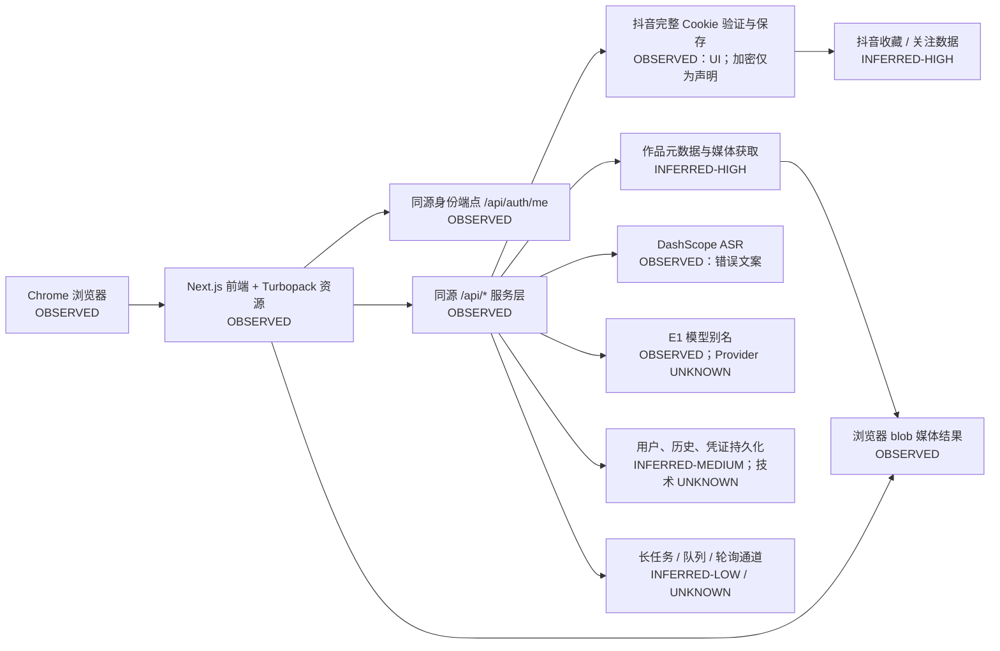

# 黑盒技术架构推断

## 证据等级

- `OBSERVED`：直接从页面、DOM、资源清单或可见文案观察到。
- `INFERRED-HIGH`：至少两个独立特征支持。
- `INFERRED-MEDIUM`：有部分特征支持，但存在其他实现可能。
- `INFERRED-LOW`：弱假设，只用于后续验证。
- `UNKNOWN`：本轮无法确认。

## 黑盒架构图



图中“加密”“持久化”“队列”不能被理解为已确认的具体实现。法律声明称凭证加密存储，但本轮没有服务端验证能力。[E-005]

## 技术维度总表

| 维度 | 结论 | 等级 | 证据与边界 |
| --- | --- | --- | --- |
| 前端框架 | Next.js | `OBSERVED` | `/_next/static/chunks/*`、`next-route-announcer`、同源路由资源 |
| React | 使用 React | `INFERRED-HIGH` | Next.js 运行时和可访问性 DOM 特征；未读取源码 |
| 构建工具 | Turbopack 产物 | `OBSERVED` | 加载资源名包含 `turbopack-*` |
| 路由 | Next.js 客户端路由或 App Router 风格 | `INFERRED-MEDIUM` | 同源页面预取资源、route announcer；未确认 Router 版本 |
| SSR / SSG / SPA | 混合渲染方式未知 | `UNKNOWN` | 没有响应正文或 hydration 时序证据 |
| CSS / UI | Tailwind 风格原子类 | `INFERRED-HIGH` | DOM 中 `h-[100dvh]`、`bg-background` 等类；具体组件库未知 |
| UI 组件库 | 可能是自建或 shadcn/Radix 类组件 | `INFERRED-LOW` | 暗色主题、ARIA 状态存在，但没有库标识，不应定论 |
| 状态管理 | 客户端状态存在；库未知 | `UNKNOWN` | 菜单、页签和处理状态可见；未见 Redux/Zustand 等证据 |
| API 风格 | 同源 REST-like `/api/*` | `INFERRED-HIGH` | `/api/auth/me`、`/api/douyin/credential/validate` 路径可见 |
| 登录提供方 | 站内账号存在 | `OBSERVED` | 用户菜单和身份资源；具体 IdP 未知 |
| Session 机制 | 可能为 first-party session | `INFERRED-MEDIUM` | 跨页面登录态持续；未读取 Cookie/Storage，因此机制未知 |
| 抖音凭证 | 完整 Cookie 输入、验证并保存 | `OBSERVED` | 设置页；值从未读取或提交 |
| 文件上传 | 未见 | `UNKNOWN` | 首页只有链接输入 |
| 媒体交付 | 页面生成 blob URL 供下载 | `OBSERVED` | 封面、视频、音频下载链接均为浏览器 blob |
| 对象存储 / CDN | 未确认 | `UNKNOWN` | blob 隐藏了上游来源；无安全的网络 Header 证据 |
| 长任务 | 有“处理中，完成后自动展示” | `OBSERVED` | 没有百分比、阶段或 ETA |
| 轮询 / SSE / WebSocket | 未确认 | `UNKNOWN` | 网络事件通道不可用，不能猜测 |
| 任务队列 | 可能存在异步 ASR/模型任务 | `INFERRED-LOW` | UI 长任务文案和提供方错误；也可能是同步请求加客户端等待 |
| 数据库 | 远端持久化很可能存在 | `INFERRED-MEDIUM` | 登录、历史和凭证保存语义；数据库产品与 Schema 未知 |
| ASR Provider | DashScope | `OBSERVED` | 可见错误文案明确命名 |
| AI Provider | `E1` 仅为产品别名 | `OBSERVED` / `UNKNOWN` | 名称可见；底层模型、网关、参数和版本未知 |
| 埋点 / 监控 | 未观察到站点第三方资源 | `UNKNOWN` | 不能把浏览器控制组件自己的日志归因于 EchoLens |
| 托管 / CDN | 未确认 | `UNKNOWN` | 未获得响应 Header，不根据域名猜测供应商 |
| 限流 / 额度 | 未见 | `UNKNOWN` | 没有额度或 429 样本；未触发调用 |
| 错误结构 | UI 可显示提供方错误文本 | `OBSERVED` | JSON 错误 Schema 和 HTTP 状态未知 |

## 可见资源与路径模式

页面资源清单只说明“浏览器观察到该资源”，不说明请求方法、状态码或正文。[E-009][E-010]

| 脱敏路径模式 | 触发页面 | 类型 | 方法 | 状态 | 解释 |
| --- | --- | --- | --- | --- | --- |
| `/_next/static/chunks/{hash}.js` | 全站 | script | `UNKNOWN` | `UNKNOWN` | Next.js 客户端资源 |
| `/_next/static/chunks/{hash}.css` | 全站 | stylesheet | `UNKNOWN` | `UNKNOWN` | 样式资源 |
| `/api/auth/me` | 登录后页面 | other/resource | `UNKNOWN` | `UNKNOWN` | 当前站内身份信息 |
| `/api/douyin/credential/validate` | 设置/收藏相关页面资源 | other/resource | `UNKNOWN` | `UNKNOWN` | 凭证状态或验证相关；具体动作不能由路径确定 |
| `/` | 路由预取/导航 | other/resource | `UNKNOWN` | `UNKNOWN` | 首页 |
| `/settings` | 路由预取/导航 | other/resource | `UNKNOWN` | `UNKNOWN` | 设置页 |
| `/douyin/favorites` | 路由预取/导航 | other/resource | `UNKNOWN` | `UNKNOWN` | 收藏页 |
| `/douyin/following` | 路由预取/导航 | other/resource | `UNKNOWN` | `UNKNOWN` | 关注页 |

未记录 Cookie、Authorization、Token、完整用户 ID、邮箱、签名参数或响应正文。

## 身份与凭证边界

### 已观察

- 站内账户登录态跨五个页面保持。
- 首页加载身份资源并显示用户菜单。
- 抖音登录态不是站内登录的一部分；它是设置页中的第二类敏感凭证。
- 收藏和关注在缺少抖音凭证时被功能性阻断。
- 法律声明称访问凭证仅在用户主动提供时处理，经 HTTPS 传输、加密存储、不进入日志，可由用户清除。[E-004][E-005]

### 不能确认

- 站内 Session 是 HttpOnly Cookie、Bearer 还是其他机制。
- 凭证加密算法、密钥管理、轮换、租户隔离和删除语义。
- 抖音 Cookie 的最小权限范围和验证请求会访问哪些接口。
- 是否有服务端审计、风控和泄露告警。

## 媒体与分析管线推断

可能的最小链路为：

```text
分享链接
→ 服务端或受控数据源解析作品元数据
→ 获取/代理封面、视频、音频
→ 浏览器生成 blob 下载对象
→ 音频提交 DashScope ASR
→ 转写文本交给 E1 模型入口
→ 结果关联站内用户历史
```

其中“解析”“获取/代理”“提交”“关联历史”是基于界面组合的 `INFERRED-MEDIUM`，不是已确认接口实现。无法确认媒体是否落盘、是否走对象存储、是否先抽音频、是否有队列或如何保存结果。

## 前后端错误结构

唯一可见业务错误是 ASR 提供方语义错误。它直接暴露提供方和错误消息，对定位有帮助，但也表明错误没有被转换为稳定的产品级错误码、可恢复建议和部分结果状态。后端 HTTP 状态、JSON 字段和重试策略均 `UNKNOWN`。

## 网络观察限制

受限 Chrome 连接可以列出页面已加载资源，但 CDP `Network.enable` 连续超时；Resource Timing 也未由当前受限页面执行环境提供。按研究边界停止继续尝试，因此以下内容没有证据：

- 请求方法与状态码。
- Content-Type 和响应 Header。
- 请求耗时和轮询频率。
- SSE / WebSocket。
- 响应字段结构。
- 限流或额度错误。

这些缺口必须保持 `UNKNOWN`，不能用 Next.js 常见做法代替事实。[E-011]

## 架构可信度结论

- 前端：高可信，可确认 Next.js 资源体系和 Turbopack 产物。
- 身份/API：中等，可确认同源身份和凭证相关路径，机制未知。
- 媒体/ASR：中等，可确认 blob 结果和 DashScope 错误，管线未知。
- AI/队列/数据库/托管：低可信，只有产品表象。

整体架构推断可信度：**45%**。本报告不建议根据这些推断复制后端选型。
